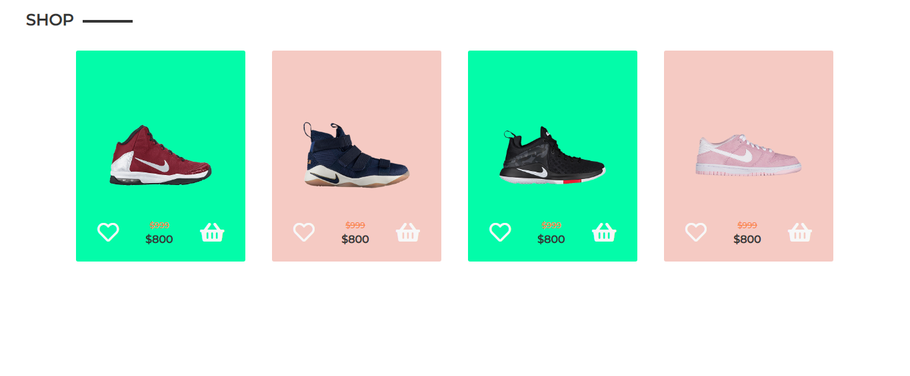

<h1> Card de Produtos</h1>
<h4>Este protótipo consiste na aplicação do sistema de grid e na utilização de pequenas animações. O foco era apenas usar CSS e HTML, tentando, ao mesmo tempo, fazer com que pareça um produto viável.</h4>

